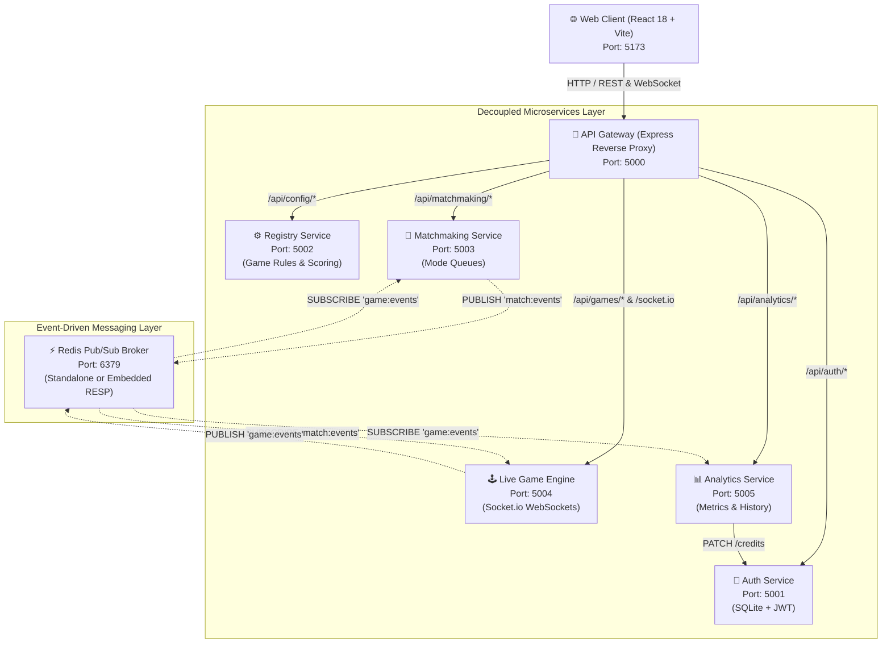

# 🎮 NexToe: Technical Architecture & System Documentation

## 1. Executive Summary & Problem Statement

The **NexToe Platform** is a full-stack, distributed multiplayer gaming platform engineered using a **Hybrid Microservice and Event-Driven Architecture (EDA)**. The system is designed to allow game creators and platform administrators to configure, deploy, and host online multiplayer turn-based games—specifically real-time **Tic-Tac-Toe** with generalized $N \times N$ grid dimensions ($3 \times 3$, $4 \times 4$, and $5 \times 5$) and flexible $K$-in-a-row winning conditions.

### Core Objectives & Specifications Met
1. **Multi-Terminal & Cross-Machine Access**: Stateless JWT-based authentication enabling users to log in concurrently from independent browser sessions, separate physical machines across a Local Area Network (LAN), or containerized environments.
2. **Game Creator APIs**: RESTful interfaces allowing administrators/creators to define game board size ($N \times N$), target winning streak ($K$), turn timeouts, and scoring policies without requiring engine restarts.
3. **Credit & Scoring Policies**: Dynamic credit economy with configurable awards for wins, penalties for losses, and compensation for draws, applied automatically via asynchronous event listeners upon game completion.
4. **Rich Visualizations**: Interactive React frontend powered by Recharts, offering visual game board animations, real-time turn countdown timers, win-rate comparisons, outcome distribution pie charts, and credit leaderboards.
5. **Multi-User Match & Team Formation**: Dedicated matchmaking service maintaining isolated queues per game mode, automatically pairing opponents into two-player lobbies (Player X vs Player O).
6. **Game Analytics**: Asynchronous analytics engine recording match durations, move counts, winner/loser IDs, and timestamps into relational storage for reporting.
7. **Clean Software Interface Design**: Unified entry point via an API Gateway handling reverse proxying, JWT verification, and WebSocket protocol upgrades.

---

## 2. High-Level System Architecture

The platform separates responsibilities into **5 independent backend microservices**, **1 API Gateway**, **1 Redis Pub/Sub message broker**, and **1 React frontend client**:



---

## 3. Microservices Breakdown & Port Registry

| Service | Port | Primary Responsibility | Data Store / State |
| :--- | :---: | :--- | :--- |
| **API Gateway** | `5000` | Single entry point, routing, reverse proxying, and WebSocket stream forwarding | Stateless |
| **Auth Service** | `5001` | User registration, login, JWT issuance, password hashing, and user credit balances | SQLite (`auth.sqlite`) |
| **Registry Service** | `5002` | Admin/Creator rule definition ($N \times N$, $K$-in-a-row) and credit reward/penalty policies | SQLite (`registry.sqlite`) |
| **Matchmaking Service** | `5003` | Mode-specific player queues ($3 \times 3$, $4 \times 4$, $5 \times 5$) and automated player pairing | In-memory queues + Redis client |
| **Live Game Engine** | `5004` | Full-duplex WebSocket game rooms, move validation, win evaluation, turn timer enforcement | In-memory active game map |
| **Analytics & Scoring** | `5005` | Event listener for game completion, credit distribution, and analytical aggregations | SQLite (`analytics.sqlite`) |
| **Redis Broker** | `6379` | Asynchronous pub/sub message bus (with embedded fallback server) | In-Memory (RESP protocol) |
| **Frontend Client** | `5173` | Responsive web interface for gameplay, administration, and analytics | Local storage (JWT cache) |

---

## 4. Event-Driven Architecture (EDA) & Message Contracts

To maintain loose coupling, backend services interact asynchronously through the **Redis Pub/Sub** message broker.

### 4.1. Channel: `match:events`
Published by **Matchmaking Service** when two players in the same queue are paired; consumed by **Live Game Engine** to provision the game room.

**Payload Schema:**
```json
{
  "event": "MATCH_CREATED",
  "matchId": "match-a1b2c3d4",
  "gridSize": 4,
  "winCondition": 4,
  "match": {
    "matchId": "match-a1b2c3d4",
    "gridSize": 4,
    "winCondition": 4,
    "playerX": { "userId": "usr-1", "username": "player1", "symbol": "X" },
    "playerO": { "userId": "usr-2", "username": "player2", "symbol": "O" },
    "createdAt": "2026-10-07T12:00:00.000Z",
    "status": "ready"
  },
  "timestamp": "2026-10-07T12:00:00.000Z"
}
```

### 4.2. Channel: `game:events`
Published by **Live Game Engine** when a match terminates (win, draw, resignation, or timeout); consumed by **Analytics & Scoring Service** (to settle credits and record stats) and **Matchmaking Service** (to release players back to idle status).

**Payload Schema:**
```json
{
  "event": "GAME_OVER",
  "matchId": "match-a1b2c3d4",
  "winnerId": "usr-1",
  "loserId": "usr-2",
  "isDraw": false,
  "reason": "win",
  "players": {
    "playerX": { "userId": "usr-1", "username": "player1" },
    "playerO": { "userId": "usr-2", "username": "player2" }
  },
  "moveCount": 7,
  "gridSize": 4,
  "winCondition": 4,
  "durationSeconds": 42,
  "endedAt": "2026-10-07T12:00:42.000Z"
}
```

---

## 5. Software Interface Design (API Reference)

All endpoints are accessed through the **API Gateway** (`http://localhost:5000`).

### 5.1. Authentication APIs (`/api/auth`)

#### `POST /api/auth/register`
- **Description**: Registers a new user.
- **Request Body**:
  ```json
  { "username": "alice", "password": "securePassword123", "role": "player" }
  ```
- **Response `(201 Created)`**:
  ```json
  {
    "message": "User registered successfully",
    "token": "eyJhbGciOiJIUzI1NiIsInR5cCI6IkpXVCJ9...",
    "user": { "id": "usr-9f8e7d", "username": "alice", "role": "player", "credits": 100 }
  }
  ```

#### `POST /api/auth/login`
- **Description**: Authenticates existing credentials and returns a 24h JWT.
- **Request Body**:
  ```json
  { "username": "alice", "password": "securePassword123" }
  ```
- **Response `(200 OK)`**:
  ```json
  {
    "message": "Login successful",
    "token": "eyJhbGciOiJIUzI1NiIsInR5cCI6IkpXVCJ9...",
    "user": { "id": "usr-9f8e7d", "username": "alice", "role": "player", "credits": 100 }
  }
  ```

#### `GET /api/auth/verify`
- **Description**: Validates session token and returns current user details.
- **Headers**: `Authorization: Bearer <token>`
- **Response `(200 OK)`**: Current user object with up-to-date credit balance.

---

### 5.2. Game Creator & Configuration APIs (`/api/config`)

#### `GET /api/config/rules`
- **Description**: Public endpoint returning current active rules.
- **Response `(200 OK)`**:
  ```json
  { "rules": { "gridSize": 3, "winCondition": 3, "turnTimeoutSeconds": 30 } }
  ```

#### `POST /api/config/rules`
- **Description**: Creator/Admin API to upload or modify game dimensions, win conditions, and timeouts.
- **Headers**: `Authorization: Bearer <token>` *(Role: `admin` required)*
- **Request Body**:
  ```json
  { "gridSize": 4, "winCondition": 4, "turnTimeoutSeconds": 25 }
  ```
- **Validation Rules**:
  - `gridSize`: Integer between `3` and `8`.
  - `winCondition`: Integer between `3` and `gridSize`.
  - `turnTimeoutSeconds`: Integer between `5` and `120`.

#### `POST /api/config/scoring`
- **Description**: Creator/Admin API to configure credit settlement rules.
- **Headers**: `Authorization: Bearer <token>` *(Role: `admin` required)*
- **Request Body**:
  ```json
  { "winCredits": 50, "lossCredits": -10, "drawCredits": 10 }
  ```

---

### 5.3. Matchmaking & Team Formation APIs (`/api/matchmaking`)

#### `POST /api/matchmaking/join`
- **Description**: Registers player into the matchmaking queue for a specific mode.
- **Request Body**:
  ```json
  { "userId": "usr-9f8e7d", "username": "alice", "gridSize": 4 }
  ```
- **Response `(200 OK)`**:
  ```json
  {
    "message": "Joined 4x4 matchmaking queue",
    "status": "queued",
    "gridSize": 4,
    "queuePosition": 1,
    "match": null
  }
  ```

#### `GET /api/matchmaking/status/:userId`
- **Description**: Polled by client while in lobby to determine whether a match has been formed.
- **Response `(200 OK)`**:
  - When searching: `{ "status": "queued", "gridSize": 4, "queuePosition": 1, "totalQueued": 1 }`
  - When paired: `{ "status": "matched", "match": { ... } }`

---

### 5.4. Analytics APIs (`/api/analytics`)

#### `GET /api/analytics/overview`
- **Description**: Aggregate platform metrics.
- **Response `(200 OK)`**:
  ```json
  {
    "overview": {
      "totalMatches": 24,
      "totalWins": 21,
      "totalDraws": 3,
      "avgDurationSeconds": 38,
      "avgMovesPerMatch": 6.8
    }
  }
  ```

#### `GET /api/analytics/win-rates`
- **Description**: Returns per-player statistical breakdowns for rendering Recharts bar charts.
- **Response `(200 OK)`**:
  ```json
  {
    "playerStats": [
      { "username": "player1", "played": 12, "wins": 8, "losses": 3, "draws": 1, "winRate": 67 },
      { "username": "player2", "played": 12, "wins": 3, "losses": 8, "draws": 1, "winRate": 25 }
    ]
  }
  ```

---

### 5.5. WebSocket Real-Time Interface (`ws://localhost:5000/socket.io`)

| Event Name | Direction | Payload | Description |
| :--- | :---: | :--- | :--- |
| `join_game` | Client ➔ Server | `{ matchId, userId, username, playerSymbol }` | Player joins room; server triggers `game_start` once both players connect |
| `game_start` | Server ➔ Client | `{ matchId, players, currentTurn, board, gridSize, winCondition }` | Synchronizes initial board state |
| `make_move` | Client ➔ Server | `{ matchId, cellIndex, playerSymbol }` | Client attempts to place mark at `cellIndex` |
| `move_made` | Server ➔ Client | `{ cellIndex, playerSymbol, nextTurn, board }` | Broadcast to both clients on valid move |
| `game_over` | Server ➔ Client | `{ winner, winningLine, isDraw, reason }` | Broadcast upon terminal game condition |
| `player_left` | Server ➔ Client | `{ disconnectedPlayer, remainingPlayer }` | Broadcast if opponent abandons session |

---

## 6. Generalized Win Evaluation Algorithm

The game engine utilizes a generalized algorithm capable of evaluating any $N \times N$ board for an arbitrary target line of length $K$:

Given board dimension $N$ and winning condition $K$:
1. **Row Check**: For every row $r \in [0, N-1]$ and column start $c \in [0, N-K]$, test consecutive cells $\{r \times N + c + i \mid i \in [0, K-1]\}$.
2. **Column Check**: For every column $c \in [0, N-1]$ and row start $r \in [0, N-K]$, test consecutive cells $\{(r + i) \times N + c \mid i \in [0, K-1]\}$.
3. **Main Diagonal ($\searrow$) Check**: For row start $r \in [0, N-K]$ and column start $c \in [0, N-K]$, test cells $\{(r + i) \times N + (c + i) \mid i \in [0, K-1]\}$.
4. **Anti-Diagonal ($\swarrow$) Check**: For row start $r \in [0, N-K]$ and column start $c \in [K-1, N-1]$, test cells $\{(r + i) \times N + (c - i) \mid i \in [0, K-1]\}$.

Time complexity for move evaluation is $\mathcal{O}(N^2)$ in the worst case, executing in under $1\,\text{ms}$ on standard hardware.

---

## 7. Frontend User Experience & Visualizations

The React frontend (`/frontend`) is organized into distinct views:
1. **Authentication Screen (`AuthScreen.tsx`)**:
   - Tabbed login/register interface.
   - Quick one-click demo presets for `player1`, `player2`, and `admin`.
2. **Arena Lobby (`PlayerLobby.tsx`)**:
   - Mode Selector: Classic $3 \times 3$, Tactical $4 \times 4$, Grand $5 \times 5$.
   - Live queue status indicator with timer counter and cancel option.
   - Profile card displaying real-time user credit badge.
3. **Live Board (`GameBoard.tsx`)**:
   - Adaptive SVG grid layout scaling automatically for $3 \times 3$, $4 \times 4$, or $5 \times 5$.
   - Neon glow highlights for the winning sequence upon victory.
   - Active turn badge, countdown timer, and move log stream.
4. **Admin & Analytics Dashboard (`AdminDashboard.tsx`)**:
   - **Creator Rules Studio**: Form to update $N \times N$, $K$, and timeout.
   - **Scoring Policy Configurator**: Adjust win, loss, and draw rewards.
   - **Recharts Bar Chart**: Wins vs Losses vs Draws grouped by player.
   - **Recharts Pie Chart**: Distribution of match outcomes (Wins vs Draws).
   - **KPI Metric Cards**: Total Matches, Platform Win Rate, Average Move Count, Average Match Duration.
   - **Live Leaderboard**: Real-time player ranking by credit balance.

---

## 8. Deployment, Resilience & Testing

### 8.1. Zero-Dependency Resilience
When launching with `node start-dev.js`, the platform checks whether a Redis server is listening on port `6379`. If neither Redis nor Docker is running, the orchestrator boots an **in-memory RESP-compatible Redis server** (`scripts/embedded-redis.js`) directly in Node.js, ensuring the platform works out-of-the-box on any development machine.

### 8.2. Containerized Deployment
A multi-container `docker-compose.yml` is provided for containerized environments:
```bash
docker compose up --build
```
This deploys Redis alongside individual containers for all services and the Vite frontend.

### 8.3. Automated Integration Tests
The test runner (`test/integration-test.js`) executes automated verification of:
- Standard $3 \times 3$ diagonal wins.
- $4 \times 4$ horizontal wins ($K=4$).
- Rejection of moves on occupied cells.
- Rejection of out-of-turn moves.
- Correct detection of stalemate / draw states.

Run tests via:
```bash
node test/integration-test.js
```
