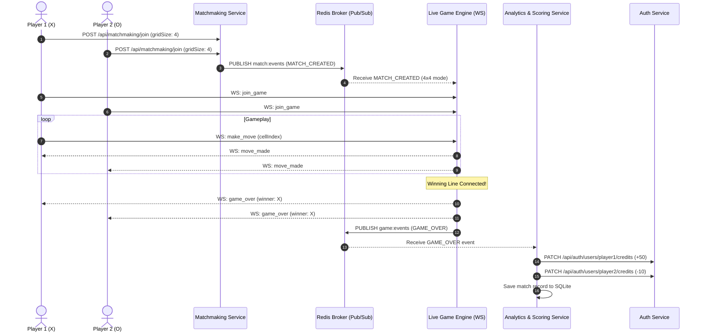

# 🎮 NexToe: Real-Time Multiplayer Microservices Platform

A production-ready, full-stack multiplayer gaming platform built with a **Hybrid Microservice and Event-Driven Architecture (EDA)**. The platform hosts a real-time Tic-Tac-Toe engine supporting dynamic game modes ($3 \times 3$, $4 \times 4$, and $5 \times 5$), role-based authentication, live WebSocket synchronization, creator APIs for rules and scoring policies, matchmaking queues, and automated credit scoring via Redis Pub/Sub.

---

## 📋 Project Requirements Compliance Matrix

This platform satisfies all project specifications:

| Requirement Clause | Status | Implementation Details |
| :--- | :---: | :--- |
| **Game Selection** *(Any one game, e.g. Tic-Tac-Toe)* | ✅ **Satisfied** | Real-time multiplayer **Tic-Tac-Toe** with configurable grid sizes ($3 \times 3$, $4 \times 4$, $5 \times 5$) and generalized $K$-in-a-row win conditions. |
| **User Login from Different Terminals & Physical Machines** | ✅ **Satisfied** | Stateless JWT authentication with `bcryptjs` password hashing and independent terminal sessions. Accessible locally across different tabs/incognito windows or across separate physical machines via LAN IP. |
| **APIs to Upload Game Information, Rules & Winning Conditions** | ✅ **Satisfied** | **Registry Service** exposes `POST /api/config/rules` and `GET /api/config/rules` allowing game creators to configure grid size, winning condition, and turn timeouts via REST and the Admin Dashboard. |
| **Credit / Scoring Policies** | ✅ **Satisfied** | Configurable scoring policy (`POST /api/config/scoring`) defining win rewards, loss penalties, and draw credits. Applied automatically to player accounts upon match completion. |
| **Visualizations** | ✅ **Satisfied** | Interactive **Recharts** data visualizations (player win/loss/draw bar charts, game outcome distribution pie charts, metric cards, credit leaderboards) and real-time visual game boards with line highlights. |
| **Multi-User Team / Match Formation** | ✅ **Satisfied** | **Matchmaking Service** maintains mode-specific player queues, pairing waiting users into 2-player match lobbies (Player X vs Player O) and broadcasting `MATCH_CREATED` events. |
| **Game Analytics** | ✅ **Satisfied** | **Analytics & Scoring Service** logs match durations, move counts, winner/loser IDs, and timestamps to SQLite, providing aggregate overview metrics and per-player win rates. |
| **Microservice & Event-Driven Architecture (EDA)** | ✅ **Satisfied** | 5 decoupled microservices + API Gateway communicating via REST and **Redis Pub/Sub** (`match:events`, `game:events`) with embedded RESP server fallback. |
| **Software Interface Design** | ✅ **Satisfied** | Centralized reverse-proxy **API Gateway** on port `5000`, structured RESTful endpoints with JSON schemas, and full-duplex WebSocket interfaces via Socket.io. |

---

## 🏛️ System Architecture

```
                                 [ Web Clients / Browsers ]
                                              │ (Port 5173)
                                              ▼
                                  ╔═══════════════════════╗
                                  ║  API Gateway (5000)   ║
                                  ╚═══════════════════════╝
                                              │
         ┌────────────────────┬───────────────┼───────────────┬────────────────────┐
         ▼                    ▼               ▼               ▼                    ▼
   Auth (5001)        Config (5002)     Match (5003)     Game (5004)       Analytics (5005)
(SQLite & JWT)      (RBAC Rules Engine) (Mode Queues)   (Live WebSockets)  (Scoring & Metrics)
                                              │               │                    ▲
                                              │ (match:events)│ (game:events)      │
                                              ▼               ▼                    │
                                  ╔════════════════════════════════════════════════╗
                                  ║       Redis Pub/Sub Event Broker (6379)        ║
                                  ║    (With auto-fallback embedded RESP server)   ║
                                  ╚════════════════════════════════════════════════╝
```

### Microservices Breakdown

| Service | Port | Description | Tech Stack |
|---|---|---|---|
| **API Gateway** | `5000` | Single entry point, reverse proxy for REST routes and WebSocket connection upgrades | Node.js, Express, `http-proxy-middleware` |
| **Auth Service** | `5001` | Multi-terminal JWT auth, password hashing (`bcryptjs`), user credit balances | Node.js, Express, SQLite |
| **Registry Service** | `5002` | Admin/Creator rule management ($N \times N$, $K$-in-a-row) & credit reward/penalty policies | Node.js, Express, SQLite |
| **Matchmaking** | `5003` | Mode-specific player queues ($3 \times 3$, $4 \times 4$, $5 \times 5$) & match pairing publisher | Node.js, Express, `ioredis` |
| **Live Game Engine** | `5004` | Real-time move broadcasting, generalized win evaluation, `GAME_OVER` publisher | Node.js, Socket.io, `ioredis` |
| **Analytics & Scoring** | `5005` | Event subscriber to `game:events`, reactive credit updates, analytics APIs | Node.js, Express, `ioredis`, SQLite |
| **Frontend UI** | `5173` | Responsive Arena Lobby, Live Board, and Admin Dashboard with Recharts | React 18, TypeScript, Tailwind CSS, Recharts |

---

## 🔌 Software Interface Design (REST & WebSocket APIs)

All requests from clients flow through the **API Gateway** (`http://localhost:5000`):

### 1. Game Configuration & Creator APIs (`/api/config`)
- **`GET /api/config/rules`**: Retrieve active game configuration (`gridSize`, `winCondition`, `turnTimeoutSeconds`).
- **`POST /api/config/rules`**: Update/upload game rules *(Admin/Creator only, Bearer JWT)*.
  ```json
  { "gridSize": 4, "winCondition": 4, "turnTimeoutSeconds": 30 }
  ```
- **`GET /api/config/scoring`**: Retrieve active credit scoring policy.
- **`POST /api/config/scoring`**: Update credit scoring policy *(Admin/Creator only, Bearer JWT)*.
  ```json
  { "winCredits": 50, "lossCredits": -10, "drawCredits": 10 }
  ```
- **`GET /api/config/all`**: Retrieve combined rules and scoring policies.

### 2. Authentication & User Management (`/api/auth`)
- **`POST /api/auth/register`**: Register a new user account (`username`, `password`, `role`).
- **`POST /api/auth/login`**: Authenticate user and issue 24-hour JWT token.
- **`GET /api/auth/verify`**: Verify JWT token and fetch profile with current credit balance.
- **`GET /api/auth/users`**: List all registered users and credit standings.
- **`PATCH /api/auth/users/:id/credits`**: Internal service endpoint to credit/debit balances.

### 3. Matchmaking & Team Formation (`/api/matchmaking`)
- **`POST /api/matchmaking/join`**: Enqueue player for a specific grid mode (`userId`, `username`, `gridSize`).
- **`POST /api/matchmaking/leave`**: Cancel queue search.
- **`GET /api/matchmaking/status/:userId`**: Poll player matchmaking state (`queued`, `matched`, `idle`).
- **`GET /api/matchmaking/queue`**: View active waiting counts per mode.

### 4. Game Analytics & Visualizations (`/api/analytics`)
- **`GET /api/analytics/overview`**: Summary metrics (total matches, wins, draws, average duration, average moves).
- **`GET /api/analytics/matches`**: Complete historical match records log.
- **`GET /api/analytics/win-rates`**: Per-player win/loss/draw records and win rate percentages for Recharts graphs.
- **`GET /api/analytics/leaderboard`**: User leaderboard ranked by credit balance.

### 5. Real-Time Game Engine WebSockets (`ws://localhost:5000/socket.io`)
- **`join_game`**: Connect player to room (`matchId`, `userId`, `username`, `playerSymbol`).
- **`make_move`**: Submit move (`matchId`, `cellIndex`, `playerSymbol`).
- **`move_made`**: Broadcast updated board state to both clients.
- **`game_over`**: Broadcast game outcome and winning line indices.
- **`player_left`**: Broadcast resignation / disconnect event.

---

## 📡 Event-Driven Sequence Diagram



---

## 🚀 Quick Start Guide

### Prerequisites
- [Node.js](https://nodejs.org/) v18 or higher (v22+ recommended)
- *(Optional)* [Docker Desktop](https://www.docker.com/) if using containerized deployment

---

### Option A: Run Locally (Fastest)

1. **Install dependencies across all microservices & frontend:**
   ```bash
   node scripts/install-all.js
   ```

2. **Run integration tests (verifies engine logic and rules):**
   ```bash
   node test/integration-test.js
   ```

3. **Start all services and frontend:**
   ```bash
   node start-dev.js
   ```

4. **Access the application:**
   👉 **[http://localhost:5173](http://localhost:5173)**

---

### Option B: Run with Docker Compose

```bash
docker compose up --build
```
Access the application at [http://localhost:5173](http://localhost:5173).

---

## 👥 Demo Accounts (Instant Testing)

Use the 1-click quick login presets on the login screen:

| Username | Password | Role | Description |
|---|---|---|---|
| `player1` | `password123` | `player` | Player account (starts with 100 Credits) |
| `player2` | `password123` | `player` | Player account (starts with 100 Credits) |
| `admin` | `admin123` | `admin` | Platform Admin / Creator (starts with 500 Credits) |

---

## 🖥️ Multi-Terminal & Multi-Machine Testing

### 1. Multi-Terminal on the Same Machine
1. Open a regular browser tab at `http://localhost:5173` and click **`player1`**.
2. Open a separate **Incognito / Private** window at `http://localhost:5173` and click **`player2`**.
3. In both windows, select the same mode (e.g. **Tactical 4 × 4**) and click **Find Match**.
4. Both terminals pair instantly and launch into the interactive board.

### 2. Multi-Terminal Across Different Physical Machines (LAN)
1. Find the host machine's local IP address (e.g., `ipconfig` on Windows or `ifconfig` on Linux/macOS, e.g. `192.168.1.50`).
2. Start the platform on the host with `node start-dev.js` (or start the frontend with `npm run dev -- --host`).
3. On the second physical machine connected to the same local network, open:
   `http://192.168.1.50:5173`
4. Both machines can log in independently, queue, and play against each other in real time.

---

## 📊 Visualizations & Analytics

The platform incorporates comprehensive data visualizations:
- **Interactive Game Board**: Dynamically adjusts to $3 \times 3$, $4 \times 4$, and $5 \times 5$ grids with active turn glow, countdown timers, move history, and neon winning-line overlays.
- **Recharts Analytics Dashboard**:
  - **Player Performance Bar Chart**: Compares wins, losses, and draws across players.
  - **Outcome Distribution Pie Chart**: Visualizes victory vs draw ratios across all matches played.
  - **Platform KPI Cards**: Total Matches, Total Wins, Average Moves per Match, and Average Duration (seconds).
  - **Live Leaderboard Table**: Real-time rank and credit balance rankings.

---

## 🔒 Security & Resilience

- **Password Hashing**: Passwords stored as one-way salted hashes using `bcryptjs`.
- **Role-Based Access Control**: Sensitive configuration endpoints (`/api/config/rules`, `/api/config/scoring`) protected by JWT authentication and admin verification middleware.
- **Zero-Dependency Redis Fallback**: If a standalone Redis instance is not running locally, `start-dev.js` automatically spins up an in-memory RESP protocol Redis server on `127.0.0.1:6379`.
- **Clean Git Setup**: `.gitignore` configured to exclude runtime SQLite databases, log files, frontend build artifacts, and all service `node_modules/`.
