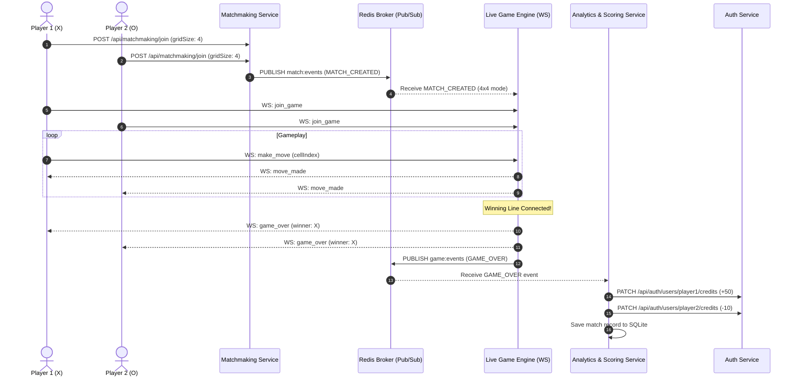

# 🎮 NexToe: Real-Time Multiplayer Microservices Platform

A production-ready, full-stack multiplayer gaming platform built with a **Hybrid Microservice and Event-Driven Architecture (EDA)**. The platform hosts a real-time Tic-Tac-Toe engine supporting dynamic game modes ($3 \times 3$, $4 \times 4$, and $5 \times 5$), role-based authentication, live WebSocket synchronization, and automated credit scoring via Redis Pub/Sub.

---

## 🏛️ System Architecture

```
                                 [ Web Clients / Browsers ]
                                              │ (Port 5173)
                                              ▼
                                  ╔═══════════════════════╗
                                  ║  API Gateway (5000)   ║
                                  ╚═══════════════════════╝
                                              │
         ┌────────────────────┬───────────────┼───────────────┬────────────────────┐
         ▼                    ▼               ▼               ▼                    ▼
   Auth (5001)        Config (5002)     Match (5003)     Game (5004)       Analytics (5005)
(SQLite & JWT)      (RBAC Rules Engine) (Mode Queues)   (Live WebSockets)  (Scoring & Metrics)
                                              │               │                    ▲
                                              │ (match:events)│ (game:events)      │
                                              ▼               ▼                    │
                                  ╔════════════════════════════════════════════════╗
                                  ║       Redis Pub/Sub Event Broker (6379)        ║
                                  ║    (With auto-fallback embedded RESP server)   ║
                                  ╚════════════════════════════════════════════════╝
```

### Microservices Breakdown
| Service | Port | Description | Tech Stack |
|---|---|---|---|
| **API Gateway** | `5000` | Single entry point, reverse proxy for REST and WebSocket stream upgrade | Node.js, Express, `http-proxy-middleware` |
| **Auth Service** | `5001` | Multi-terminal JWT auth, password hashing (`bcryptjs`), user credit balances | Node.js, Express, SQLite |
| **Registry Service** | `5002` | Admin-only rule management ($N \times N$, $K$-in-a-row) & credit reward/penalty policies | Node.js, Express, SQLite |
| **Matchmaking** | `5003` | Mode-specific player queues ($3 \times 3$, $4 \times 4$, $5 \times 5$) & match pairing publisher | Node.js, Express, `ioredis` |
| **Live Game Engine** | `5004` | Real-time move broadcasting, generalized win evaluation, `GAME_OVER` publisher | Node.js, Socket.io, `ioredis` |
| **Analytics & Scoring** | `5005` | Event subscriber to `game:events`, reactive credit updates, analytics APIs | Node.js, Express, `ioredis`, SQLite |
| **Frontend UI** | `5173` | Responsive Arena Lobby, Live Board, and Admin Dashboard | React 18, TypeScript, Tailwind CSS, Recharts |

---

## ✨ Key Features

1. **Player Game Mode Selection**:
   - Players can choose between **Classic 3 × 3**, **Tactical 4 × 4**, and **Grand 5 × 5**.
   - Matchmaking maintains isolated queues per mode so players are matched strictly with opponents seeking the same grid size.
2. **Role-Based Access Control (RBAC)**:
   - **Admin (`admin`)**: Automatically lands on the **Admin Dashboard** with full privileges to configure global game rules, turn timeouts, and scoring policies.
   - **Player (`player1`, `player2`)**: Automatically lands on the **Play Arena**, with access to queue for matches and view platform analytics in read-only mode.
3. **Event-Driven Scoring (Redis Pub/Sub)**:
   - When a match finishes, the Live Game Engine publishes an immutable `GAME_OVER` event to the `game:events` channel.
   - The Analytics Service reacts immediately: applies win/loss/draw credit adjustments via the Auth Service and stores match records in SQLite.
4. **Zero-Configuration Local Resilience**:
   - If Redis or Docker is not installed locally, the platform automatically boots an embedded in-memory Redis RESP server on `127.0.0.1:6379`.
5. **Multi-Terminal Ready**:
   - Independent JWT sessions per tab/window. Quick-login presets allow immediate 2-player testing.

---

## 🚀 Quick Start Guide

### Prerequisites
- [Node.js](https://nodejs.org/) v18 or higher (v22+ recommended)
- *(Optional)* [Docker Desktop](https://www.docker.com/) if using containerized deployment

---

### Option A: Run Locally (Fastest)

1. **Clone the repository:**
   ```bash
   git clone https://github.com/<your-username>/<your-repo-name>.git
   cd <your-repo-name>
   ```

2. **Install dependencies for all microservices & frontend:**
   ```bash
   node scripts/install-all.js
   ```

3. **(Optional) Run tests to verify the engine & event pipeline:**
   ```bash
   node test/integration-test.js
   ```

4. **Start the entire platform:**
   ```bash
   node start-dev.js
   ```

5. **Open in browser:**
   👉 **[http://localhost:5173](http://localhost:5173)**

---

### Option B: Run with Docker Compose

```bash
docker compose up --build
```
Access the application at [http://localhost:5173](http://localhost:5173).

---

## 👥 Demo Accounts (Instant Testing)

Click the one-click quick login buttons on the login screen:

| Username | Password | Role | Description |
|---|---|---|---|
| `player1` | `password123` | `player` | Player account (starts with 100 Credits) |
| `player2` | `password123` | `player` | Player account (starts with 100 Credits) |
| `admin` | `admin123` | `admin` | Platform Admin (starts with 500 Credits) |

---

## 🎮 How to Test 2-Player Gameplay

1. Open a browser window at `http://localhost:5173` and click **`player1`**.
2. Open a second **Incognito / Private** browser window at `http://localhost:5173` and click **`player2`**.
3. In both windows:
   - Select the desired mode (e.g., **Tactical 4 × 4**).
   - Click **Find 4 × 4 Match**.
4. Both windows will pair and launch into the live game board.
5. Take turns clicking cells. When someone connects 4 in a row:
   - A victory modal appears.
   - The winner receives `+50` credits and the loser receives `-10` credits.
   - The credits badge in the navbar updates reactively!
6. Click **Play Again** or **Exit to Lobby** to queue for a fresh game.

---

## 📡 Event-Driven Sequence Diagram



---

## 🔒 Security & Git Configuration

The repository includes a `.gitignore` pre-configured to keep your repository clean and secure:
- Excludes all `node_modules/` across all services and frontend.
- Excludes runtime database files (`*.sqlite`, `*.json`, `*.db`).
- Excludes frontend build outputs (`dist/`, `build/`).
- Excludes local environment files (`.env`, `.env.*`).
